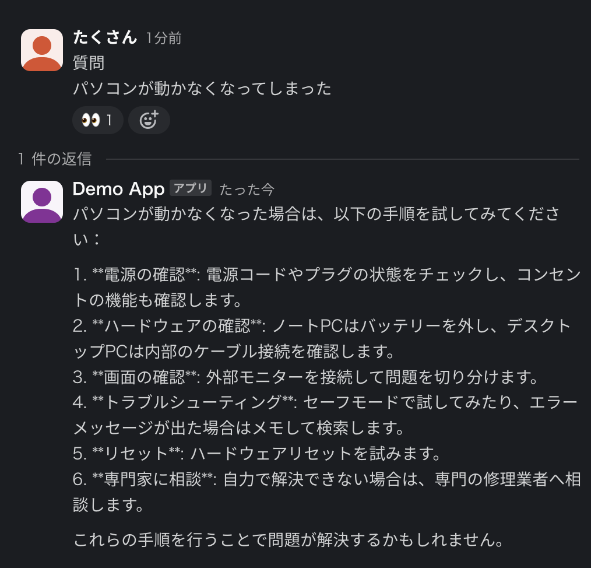
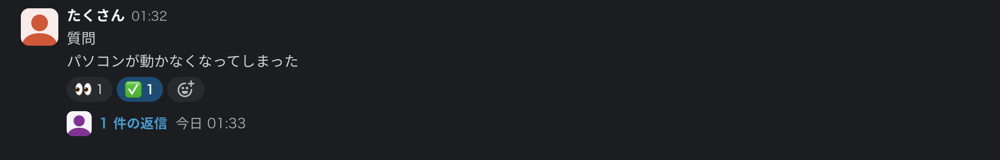
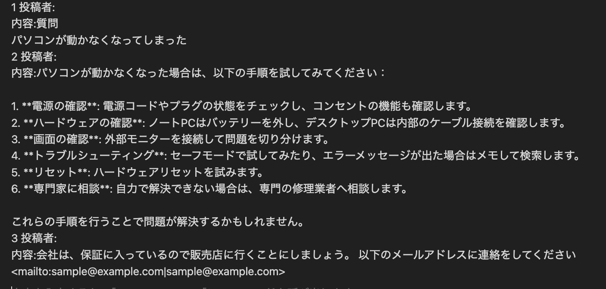

# help-it

## 概要
このツールは、SlackのBotを使用して、AI技術のRAG（Retrieval-Augmented Generation）を活用し、質問に対する回答を提供するためのものです。
回答に使用するデータはNotionに保存されており、Notionのデータベースを参照して回答が提供されます。ベクトルデータベースにはPineconeを利用しています。

## 使い方
1.	SLACK_CHANNEL_TO_POSTに設定したチャンネルに質問を投稿します。
   
2.	AIによる回答
  AIがリプライしたメッセージの下に追加のメッセージを入力することもできます。
	-	事前情報がない場合：👀リアクションが付き、AIによる回答が投稿されます。
	-	事前情報がある場合：👀リアクションが付き、Notionデータベースに登録されている情報をもとに回答が投稿されます。
  
4. Notionに情報を登録
  - ✅をクリックすると、🤖リアクションが付き、質問と回答がNotionデータベースに登録されます。
  
  - Notionデータベースには、新しいページが作成され、質問と回答が登録されます。
  
## 初期設定
1. このリポジトリをクローンします。
2. `yarn`で依存関係をインストールします。
3. `clasp login`でGoogleアカウントにログインします。
詳しい初期設定方法は[こちら](./CLASP_README.md)を参照してください。
4. Gasのスクリプト プロパティに以下の値を設定します。
    - `NOTION_API_KEY`: NotionのAPIキー
    - `NOTION_DATABASE_ID`: NotionのデータベースID
    - `OPEN_AI_KEY`: OpenAIのAPIキー
    - `PINECONE_API_KEY`: PineconeのAPIキー
    - `PINECONE_HOST_ID`: PineconeのホストID
    - `SLACK_ACCESS_TOKEN`: Slackのアクセストークン
    - `SLACK_CHANNEL_TO_POST`: Slackの投稿先チャンネル

## 今後の改良点
- RAGの際にどの情報を参照したのかを表示する（SlackのメッセージURLなど）。
- CRAGやGNN-RAGなどの技術を利用して、回答の精度を向上させる。
- Notion SDKやOpenAI SDKなどを利用して、APIの呼び出しを簡略化する。